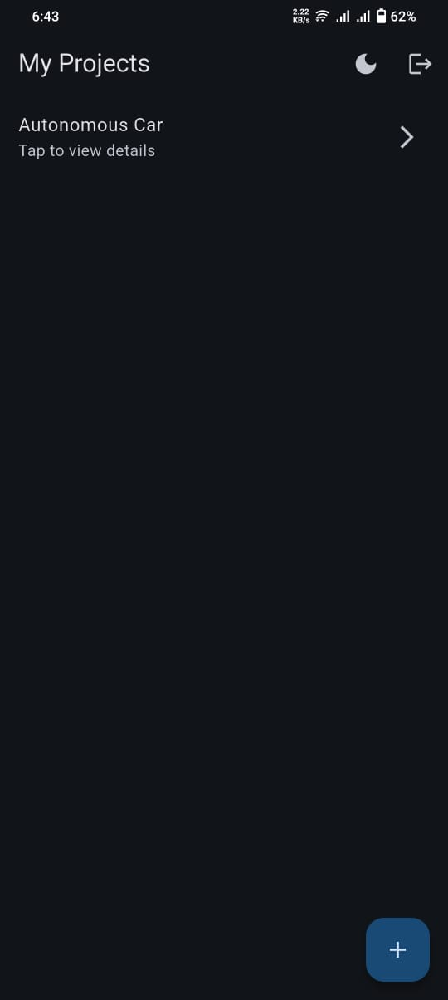
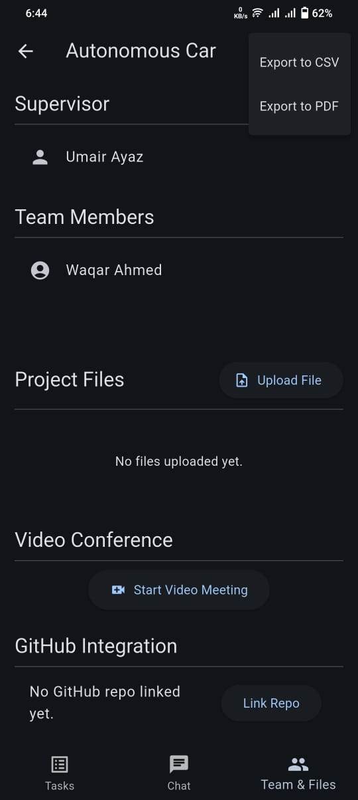
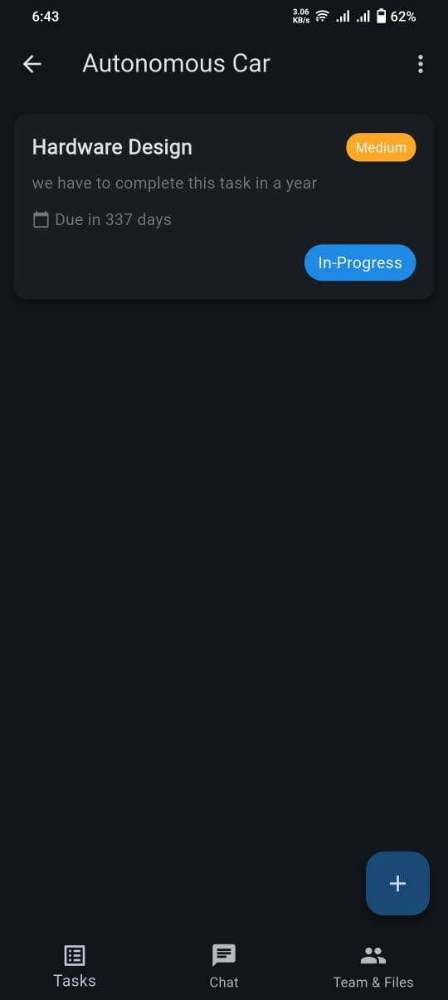
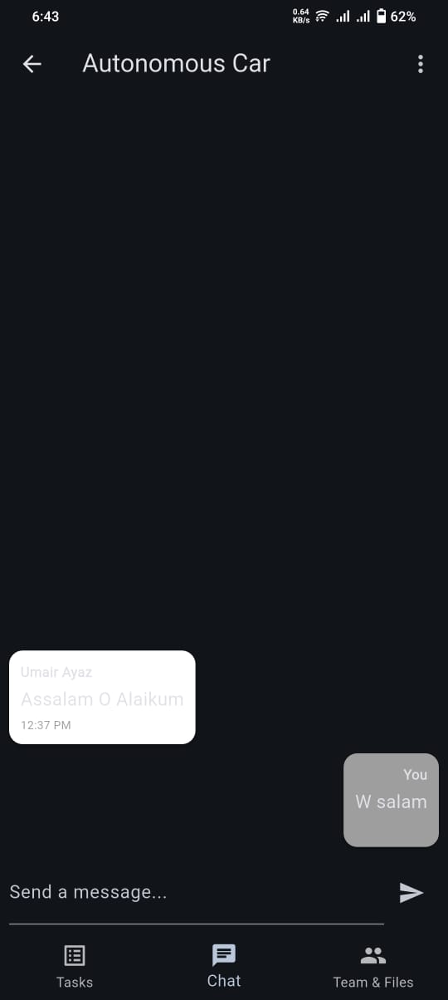

# 🎓 FYP-Assist  
**A Mobile-First Management System for Final Year Projects**

FYP-Assist is a comprehensive **Flutter-based mobile application** designed to streamline and digitize the Final Year Project (FYP) workflow. It bridges the communication gap between **students**, **supervisors**, and **coordinators** by providing a centralized platform for project tracking, milestone management, document submissions, and real-time communication.

This project is developed specifically for the **Computer Systems Engineering (CSE)** curriculum at **Sukkur IBA University**.

---

## 📱 App Gallery  
*A visual overview of the application's user interface and experience.*

### Dashboards & Navigation
| Splash Screen | Dark Mode Dashboard | Light Mode Dashboard |
|---|---|---|
|  |  |  |

### Project Management
| Project Overview | Task Management | Chat Interface |
|---|---|---|
|  |  |  |

---

## ✨ Key Features

- **Role-Based Portals**
  - Students (Project Owners)
  - Supervisors (Mentors)
  - Coordinators (Administrators)

- **Milestone & Task Tracking**
  - Real-time progress updates
  - Task status indicators and timelines

- **Integrated Chat System**
  - Direct communication between students and supervisors
  - Instant feedback and discussion threads

- **Document Repository**
  - Centralized storage for:
    - Project Proposals
    - SRS Documents
    - Final Reports
  - Version-controlled uploads using Firebase Storage

- **Meeting & Review Support**
  - Scheduling support for proposal defenses and evaluations

- **Theme Support**
  - Fully responsive **Light & Dark modes**

---

## 🛠️ Technical Stack

- **Frontend:** Flutter (Dart)
- **Backend:** Firebase
  - Firebase Authentication
  - Cloud Firestore (NoSQL Database)
  - Firebase Cloud Storage
- **State Management:** Provider
- **Development Tools:**  
  - Android Studio  
  - VS Code  
  - Git & Git Bash  

---

## 🏗️ System Architecture

The application follows a **clean MVC / MVVM-inspired architecture**, ensuring:

- Separation of concerns  
- Scalable codebase  
- Decoupled UI and backend services  
- Maintainable Firebase service layer  

---

## 🚀 Getting Started

### ✅ Prerequisites

- Flutter SDK (Latest Stable Version)
- Android Studio or VS Code
- Firebase account with a configured project
- Android Emulator or Physical Device

---

### 📥 Installation & Setup

#### 1️⃣ Clone the Repository
```bash
git clone https://github.com/Ibad-Ur-Rahman-Memon/FYP-Assist.git
```
#### 2️⃣ Navigate to Project Directory
```bash
cd FYP-Assist
```
#### 3️⃣ Install Dependencies
```bash
flutter pub get
```
### 🔥 Firebase Configuration

1. Create a project on the **Firebase Console**
2. Register your **Android** and **iOS** applications
3. Download and place the configuration files:
   - `google-services.json` → `android/app/`
   - `GoogleService-Info.plist` → `ios/Runner/`
4. Enable the following Firebase services:
   - Email/Password Authentication
   - Cloud Firestore
   - Cloud Storage

### ▶️ Run the Application
```bash
flutter run
```
## 📂 Project Structure

```plaintext
lib/
├── models/        # Data models (Users, Tasks, Messages)
├── screens/       # UI implementation for all screens
├── services/      # Firebase Auth, Firestore & Storage logic
├── widgets/       # Reusable UI components
assets/
├── images/        # UI images & screenshots
```
## 👥 User Roles & Workflow

### 👨‍🎓 Students
- Create and manage project groups
- Invite team members
- Log weekly progress
- Upload project deliverables
- Communicate with supervisors

### 👨‍🏫 Supervisors
- Monitor assigned projects
- Review submitted documents
- Provide feedback through the chat module
- Track student progress and milestones

### 🧑‍💼 Coordinators
- Oversee all department projects
- Manage supervisor assignments
- Monitor overall progress and deadlines


## 📜 License

This project is licensed under the **MIT License**.  
See the `LICENSE` file for more information.

## 👨‍💻 Developer & Contact

**Ibad Ur Rahman Memon**  
Department of Computer Systems Engineering (CSE)  
**Sukkur IBA University**

- **GitHub:** https://github.com/Ibad-Ur-Rahman-Memon  
- **LinkedIn:** https://www.linkedin.com/in/ibad-ur-rahman-memon
- **Email:** ibadurrahmanmemon.becsef22@iba-suk.edu.pk  

---

### 📌 Academic Note

This project was developed as a **semester requirement** for the  
**Mobile App Development (MAD)** course at Sukkur IBA University.

Special thanks to the respected faculty members for their guidance and support.

